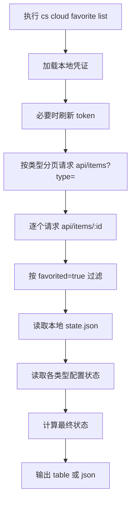
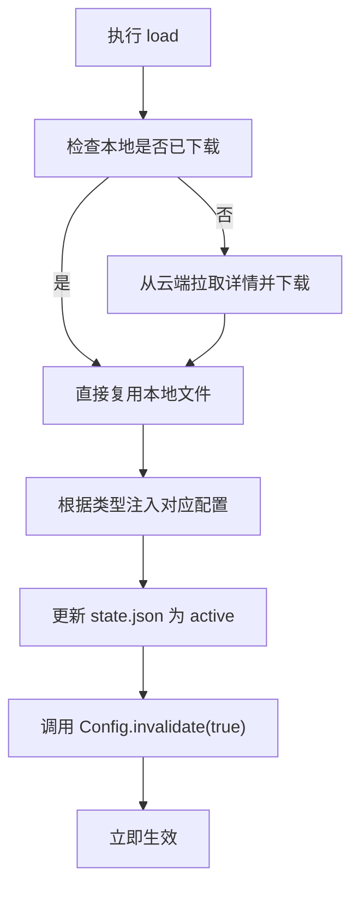

# cs cloud favorite 方案设计文档

本文档整理 `cs cloud favorite` 功能的设计目标、状态模型、实现方案、目录布局、命令行为、测试策略以及当前限制，方便后续维护、合入上游与继续演进。

## 1. 背景与目标

用户希望在 `cs cloud` 下扩展一组围绕 costrict-web 服务端收藏能力的 CLI 命令，满足以下需求：

1. 增加 `favorite list`，查看 costrict-web 的服务端收藏列表。
2. 支持对收藏项执行：查看 / 下载 / 加载 / 卸载 / 卸载本地文件。
3. 状态流转为：`Cloud -> Downloaded -> Active -> Unloaded`。
4. 下载、加载、卸载不需要重启程序。
5. 尽量最小改动；如需新增代码，优先放入 `costrict` 目录，便于管理与合入上游。
6. 支持多种收藏类型：skill、agent、command、mcp。
7. 在交互式 TUI 中也可通过 `/favorites` 命令管理收藏项。

## 2. 设计原则

本方案遵循以下设计原则：

- **最小改动优先**：复用现有 CLI、配置系统、加载链路和认证能力。
- **多类型统一管理**：skill、agent、command、mcp 共享同一套状态模型和生命周期管理。
- **下载与激活解耦**：`download` 只负责本地落盘，`load` 负责真正启用。
- **无重启生效**：通过修改全局配置并调用 `Config.invalidate(true)` 触发即时生效。
- **与上游兼容**：新增逻辑集中在 `packages/opencode/src/costrict/cloud/` 与少量 CLI 接入点。

## 3. 支持的收藏类型

当前支持四种收藏类型，每种类型有不同的存储格式和配置注册方式：

| 类型 | 服务端 itemType | 文件格式 | 配置注册方式 | 内容文件名 |
|------|----------------|----------|-------------|-----------|
| skill | `skill` | Markdown | `skills.paths[]`（路径数组） | `SKILL.md` |
| agent | `subagent` | Markdown | `config.agent[name]`（对象合并） | `<slug>.md` |
| command | `command` | Markdown | `config.command[name]`（对象合并） | `<slug>.md` |
| mcp | `mcp` | JSON | `config.mcp[name]`（对象合并） | `mcp.json` |

### 3.1 各类型激活机制

#### Skill

- 加载链路已经依赖 `config.skills.paths` 字段
- `load` 时将本地 skill 目录路径追加到 `skills.paths` 数组
- 调用 `Config.invalidate(true)` 后，skill 发现逻辑重新扫描路径

#### Agent

- Agent 通过 markdown 文件定义，frontmatter 包含 model、mode、permission 等配置
- 正文内容作为 agent 的 `prompt` 字段
- `load` 时解析 markdown，将解析结果写入 `config.agent[slug]`
- `unload` 时从 `config.agent` 中删除对应 key

#### Command

- Command 通过 markdown 文件定义，frontmatter 包含 description、agent、model 等配置
- 正文内容作为 command 的 `template` 字段
- `load` 时解析 markdown，将解析结果写入 `config.command[slug]`
- `unload` 时从 `config.command` 中删除对应 key

#### MCP

- MCP 使用 JSON 配置，包含 type（local/remote）、command/url 等字段
- `load` 时将 JSON 配置写入 `config.mcp[slug]`
- `unload` 时从 `config.mcp` 中删除对应 key

## 4. 功能范围

### 4.1 支持的命令

#### CLI 命令

- `cs cloud favorite list [--type skill|agent|command|mcp] [--format table|json]`
- `cs cloud favorite view <slug-or-id> [--format table|json]`
- `cs cloud favorite download <slug-or-id>`
- `cs cloud favorite load <slug-or-id>`
- `cs cloud favorite unload <slug-or-id>`
- `cs cloud favorite uninstall <slug-or-id>`
- `cs cloud favorite --help`
- `cs cloud favorite help`

#### 交互式 TUI 命令

- `/favorites`（别名 `/fav`）— 打开收藏管理对话框
  - `Space` 键：切换 load/unload
  - `x` 键：uninstall
  - 按类型分组显示

### 4.2 输出格式

- `list` 支持 `--format table|json`，table 模式包含 Status、Type、Slug、Name、Description 列
- `view` 支持 `--format table|json`

### 4.3 非目标

本期不做：

- 收藏项的新增/取消收藏操作（通过 web 端操作）
- 复杂权限模型或本地多用户隔离
- 独立的长期驻留运行态管理器

## 5. 状态模型设计

### 5.1 用户态状态

外部展示的状态为：

- `Cloud`
- `Downloaded`
- `Active`
- `Unloaded`

### 5.2 状态流转总览

当前状态流转如下：

```text
Cloud -> Downloaded -> Active -> Unloaded
```

除此之外还有两条重要回路：

```text
Cloud --load--> Active
Unloaded --load--> Active
Downloaded/Active/Unloaded --uninstall--> Cloud
```

### 5.3 状态流转规则说明

#### 规则 1：Cloud -> Downloaded

执行：

- `cs cloud favorite download <slug-or-id>`

效果：

- 从云端获取 item 内容
- 本地落盘内容文件与 `item.json`
- 更新 `state.json`
- **不会写入配置**
- 因此状态只会进入 `Downloaded`

#### 规则 2：Cloud -> Active

执行：

- `cs cloud favorite load <slug-or-id>`

效果：

- 若本地尚未下载，会先自动下载
- 然后根据类型写入对应配置
- 调用 `Config.invalidate(true)`
- 因此 `load` 结束后直接进入 `Active`

这意味着：

- `load` = "确保本地已下载 + 立即启用"
- 不再保留独立的 `Loaded` 中间状态

#### 规则 3：Downloaded -> Active

执行：

- `cs cloud favorite load <slug-or-id>`

效果：

- 复用已下载的本地文件
- 根据类型将配置注入全局配置
- 立即生效

#### 规则 4：Active -> Unloaded

执行：

- `cs cloud favorite unload <slug-or-id>`

效果：

- 根据类型从全局配置中移除对应配置
- 调用 `Config.invalidate(true)`
- 保留本地文件
- 状态变为 `Unloaded`

#### 规则 5：Unloaded -> Active

执行：

- `cs cloud favorite load <slug-or-id>`

效果：

- 不重新下载文件
- 重新注入配置
- 立即恢复为 `Active`

#### 规则 6：Downloaded / Active / Unloaded -> Cloud

执行：

- `cs cloud favorite uninstall <slug-or-id>`

效果：

- 删除本地 item 目录
- 删除本地 state 记录
- 若处于激活态则先移除配置
- 最终回到 `Cloud`

### 5.4 各状态含义定义

#### Cloud

- 收藏存在于服务端
- 本地未安装
- 本地状态文件中无记录

#### Downloaded

- item 已经下载并落盘到本地
- 未注入配置
- 还没有在当前 CLI 配置里启用

#### Active

- item 已在本地存在
- 对应配置已写入全局配置
- 已触发 `Config.invalidate(true)`
- 无需重启即可生效
- `load` 完成后直接进入该状态

#### Unloaded

- item 仍保留在本地
- 已从配置中移除
- 已触发配置刷新
- 当前未激活
- 可以通过再次 `load` 恢复为 `Active`

### 5.5 内部状态映射

内部持久化生命周期使用：

- `downloaded`
- `active`
- `unloaded`

外部状态计算逻辑：

1. 若本地无记录，则显示 `Cloud`
2. 根据类型检查对应配置是否包含该项：
   - skill：检查 `skills.paths` 是否包含对应路径
   - agent：检查 `config.agent` 是否包含对应 key
   - command：检查 `config.command` 是否包含对应 key
   - mcp：检查 `config.mcp` 是否包含对应 key
3. 若配置中存在，则显示 `Active`
4. 否则根据本地 `lifecycle` 映射为：
   - `unloaded -> Unloaded`
   - 其他 -> `Downloaded`

## 6. 总体架构

### 6.1 模块划分

本功能主要由以下模块组成：

| 模块 | 文件路径 | 职责 |
|------|---------|------|
| CLI 命令入口 | `packages/opencode/src/cli/cmd/cloud.ts` | 定义 `cs cloud favorite` 命令、帮助与输出 |
| 收藏核心逻辑 | `packages/opencode/src/costrict/cloud/favorite.ts` | 拉取收藏、状态管理、下载/加载/卸载 |
| 服务端路由 | `packages/opencode/src/server/routes/global.ts` | 提供 HTTP API 供 TUI 调用 |
| TUI 对话框 | `packages/opencode/src/cli/cmd/tui/component/dialog-favorite.tsx` | 交互式收藏管理界面 |
| TUI 命令注册 | `packages/opencode/src/cli/cmd/tui/app.tsx` | 注册 `/favorites` 斜杠命令 |

### 6.2 设计思路

整体思路是：

1. 从云端查询用户收藏列表（支持按类型过滤）
2. 拉取详情，构造可操作的 favorite item 数据
3. 将本地状态持久化到 `costrict/cloud-favorites/state.json`
4. 将已下载 item 落盘到本地专属目录
5. `load` 时根据类型注入对应配置
6. 调用 `Config.invalidate(true)` 实现无重启生效

### 6.3 TUI 交互式命令架构

TUI 中的收藏管理通过 HTTP API 与 worker 进程通信，确保 `Config.invalidate(true)` 在正确的进程中执行：

```text
TUI 主线程 (dialog-favorite.tsx)
  ↓ HTTP fetch
Worker 线程 (server/routes/global.ts)
  ↓ 调用
favorite.ts → 修改配置文件 + Config.invalidate(true)
  ↓
配置缓存失效 → Instance 重建 → 新配置生效
```

这解决了 CLI 独立进程中 `Config.invalidate` 无法影响运行中交互会话的问题。

## 7. 服务端数据获取方案

### 7.1 现状

仓库中可以明确看到 favorite 的写接口，但没有直接搜到"我的收藏列表"专用接口。

实际联调中发现：

- `/api/items/{id}/favorite` 可用于收藏与取消收藏
- `/api/items/{id}` 详情中含有 `favorited` 字段
- `/api/items?type=<type>` 可列出不同类型的项目

### 7.2 当前实现方案

为了在缺少明确 favorites list API 的前提下尽快实现功能，当前采用如下策略：

1. 按类型分页请求 `/api/items?type=<storeType>&page=<n>&pageSize=<size>`
2. 获取候选项列表
3. 对候选项逐个请求 `/api/items/{id}`
4. 通过详情里的 `favorited === true` 过滤出真正收藏项

类型映射关系：

| 本地类型 | 服务端 itemType |
|---------|----------------|
| skill | `skill` |
| agent | `subagent` |
| command | `command` |
| mcp | `mcp` |

核心函数：

- `listRemoteCandidates(storeType?)`
- `getRemoteItem(id)`
- `listFavoriteItems(type?)`

### 7.3 优缺点

优点：

- 不依赖服务端新增接口
- 立即可用
- 能准确拿到详情与 `favorited` 状态

缺点：

- 需要多次请求，性能较差
- 分页扫描规模大时开销增加
- 依赖服务端详情接口稳定返回 `favorited`

### 7.4 后续优化方向

如果后续服务端明确提供"我的收藏列表"接口，可以将当前实现替换为：

- 单次或少量分页请求 favorite list
- 减少逐项详情请求
- 明确支持按用户收藏维度筛选

## 8. 认证与请求模型

### 8.1 认证来源

复用现有 CoStrict 登录凭证：

- `loadCoStrictCredentials()`
- `saveCoStrictCredentials()`

### 8.2 token 刷新逻辑

在 `createAuthenticatedFetch()` 中：

1. 读取本地凭证
2. 若 access token 失效且存在 refresh token，则尝试刷新
3. 刷新成功后回写本地凭证
4. 失败则提示重新登录

复用能力：

- `isCoStrictTokenValid()`
- `refreshCoStrictToken()`
- `extractExpiryFromJWT()`
- `parseJWT()`

### 8.3 统一请求入口

`createAuthenticatedFetch()` 返回：

- `baseUrl`
- `userID`
- `json<T>(url)` 方法

这样 favorite 模块不需要重复处理认证头、token 刷新和错误格式。

## 9. 本地目录布局设计

### 9.1 根目录

本地 favorite 专属目录位于：

`Global.Path.config/costrict/cloud-favorites`

### 9.2 目录结构

```text
<config>/costrict/cloud-favorites/
├── skills/
│   └── <slug>/
│       ├── SKILL.md
│       └── item.json
├── agents/
│   └── <slug>/
│       ├── <slug>.md
│       └── item.json
├── commands/
│   └── <slug>/
│       ├── <slug>.md
│       └── item.json
├── mcp/
│   └── <slug>/
│       ├── mcp.json
│       └── item.json
└── state.json
```

### 9.3 文件职责

#### 内容文件（SKILL.md / <slug>.md / mcp.json）

- item 的实际内容文件
- skill：供 skill 发现与加载链路直接使用
- agent/command：Markdown 格式，frontmatter + prompt/template 正文
- mcp：JSON 配置，包含 type、command/url 等字段

#### item.json

- 保存服务端返回的基础元数据快照
- 便于排查与后续扩展

#### state.json

- 保存 favorite 的本地生命周期状态
- 记录 slug、id、itemType、localPath、lifecycle、时间戳等信息

## 10. 配置接入设计

### 10.1 各类型配置注入方式

#### Skill — 复用 skills.paths

- 加载时将目录路径追加到 `skills.paths[]`
- 卸载时从数组中移除

#### Agent — 写入 config.agent

- 加载时解析本地 markdown 文件（frontmatter + prompt）
- 写入 `config.agent[slug] = { ...frontmatter, prompt }`
- 卸载时删除 `config.agent[slug]`

#### Command — 写入 config.command

- 加载时解析本地 markdown 文件（frontmatter + template）
- 写入 `config.command[slug] = { ...frontmatter, template }`
- 卸载时删除 `config.command[slug]`

#### MCP — 写入 config.mcp

- 加载时读取本地 `mcp.json`
- 写入 `config.mcp[slug] = mcpConfig`
- 卸载时删除 `config.mcp[slug]`

### 10.2 配置文件定位

全局配置文件按以下顺序查找：

1. `opencode.jsonc`
2. `opencode.json`
3. `config.json`

若都不存在，则默认写入 `opencode.jsonc`。

### 10.3 配置更新方式

通过 `jsonc-parser`：

- `modify()`
- `applyEdits()`

统一使用 `patchGlobalConfig(path, value)` 和 `removeGlobalConfig(path)` 函数，对配置做精准增删，避免粗暴覆盖整个配置文件。

核心函数：

- `patchGlobalConfig(path[], value)` — 设置任意配置路径的值
- `removeGlobalConfig(path[])` — 删除任意配置路径
- `patchGlobalSkillPaths()` — skill 专用的 paths 数组操作
- `addItemToConfig(item, localPath)` — 根据类型调用对应注入逻辑
- `removeItemFromConfig(itemType, slug, localPath)` — 根据类型调用对应移除逻辑

## 11. 无重启生效方案

### 11.1 核心机制

`download` 本身只落盘，不要求即时生效。

真正影响运行态的是：

- `loadFavoriteItem()`
- `unloadFavoriteItem()`
- `uninstallFavoriteItem()`

这三个动作在修改配置后都会调用：

```ts
await Config.invalidate(true)
```

### 11.2 为什么不需要重启

`Config.invalidate(true)` 会使配置缓存失效，并等待相关依赖刷新，进而让后续发现逻辑读取到最新配置。

因此：

- `load` 后立即可被对应类型的发现流程感知
- `unload` 后立即从活动配置中移除

这满足"下载、加载、卸载不需要重启程序"的要求。

### 11.3 TUI 交互式场景

在 TUI 中通过 `/favorites` 命令执行的操作通过 HTTP API 发送到 worker 进程，确保 `Config.invalidate(true)` 在 worker 进程中执行。这解决了 CLI 独立进程中 invalidate 无法影响运行中会话的问题。

## 12. 命令行为说明

### 12.1 list

用途：

- 查看当前云端收藏列表
- 同时显示每项在本地的状态和类型

输出字段：

- `status`
- `type`（itemType）
- `slug`
- `name`
- `description`

支持 `--type` 过滤：

```bash
cs cloud favorite list --type skill
cs cloud favorite list --type agent
cs cloud favorite list --type mcp
```

### 12.2 view

用途：

- 查看单个收藏项的详细信息

输出内容包括：

- name
- slug
- id
- type
- status
- favorites count
- version
- local path（如存在）
- description

### 12.3 download

行为：

1. 拉取收藏项详情
2. 根据类型本地落盘内容文件与 `item.json`
3. 在 `state.json` 中记录为 `downloaded`

不会自动激活，只进入 `Downloaded`。

### 12.4 load

行为：

1. 确保 item 已下载
2. 若未下载则自动下载
3. 根据类型将配置注入全局配置
4. 本地状态改为 `active`
5. 调用 `Config.invalidate(true)`

结果：

- item 立即生效
- `load` 后直接进入 `Active`

### 12.5 unload

行为：

1. 确保 item 已下载
2. 根据类型从全局配置中移除对应配置
3. 状态改为 `unloaded`
4. 调用 `Config.invalidate(true)`

结果：

- item 保留在本地
- 但不再处于激活状态

### 12.6 uninstall

行为：

1. 确保 item 已下载
2. 从全局配置中移除对应配置
3. 删除本地目录
4. 从 `state.json` 中删除记录
5. 调用 `Config.invalidate(true)`

结果：

- 状态恢复为 `Cloud`

### 12.7 help

支持两种帮助入口：

- `cs cloud favorite --help`
- `cs cloud favorite help`

### 12.8 TUI /favorites

在交互式界面中输入 `/favorites` 或 `/fav` 打开收藏管理对话框：

- 按类型（Skill、Agent、Command、MCP）分组显示
- 显示状态指示器（✓ Active、↓ Downloaded、○ Unloaded、☁ Cloud）
- `Space` 键切换 load/unload
- `x` 键执行 uninstall
- 操作完成后自动刷新列表并显示 toast 提示

## 13. 核心实现流程

### 13.1 list 流程



### 13.2 load 流程



## 14. 测试设计

### 14.1 测试文件

- `packages/opencode/test/costrict/cloud/favorite.test.ts`

### 14.2 覆盖点

当前自动化测试覆盖：

1. **只列出真正 favorited 的 item**
2. **状态流转测试**：
   - `Cloud -> Downloaded -> Active -> Unloaded -> Cloud`
3. **配置写入测试**：
   - skill: `load` 会写入 `skills.paths`，`unload` 会移除
   - agent: `load` 会写入 `config.agent`，`unload` 会移除
   - command: `load` 会写入 `config.command`，`unload` 会移除
   - mcp: `load` 会写入 `config.mcp`，`unload` 会移除
4. **配置刷新调用测试**：
   - 确认 `Config.invalidate(true)` 在关键步骤被调用

### 14.3 测试方法

使用：

- `tmpdir()` 创建临时 home 与 config 目录
- mock `fetch` 模拟服务端 favorite list 与详情接口
- 真实验证本地文件、状态文件与配置文件变化

已验证命令：

```bash
bun test test/costrict/cloud/favorite.test.ts
bun run typecheck
```

## 15. 当前限制与已知问题

### 15.1 服务端接口不够理想

当前没有直接依赖专门的 favorites list API，而是通过：

- 列表扫描
- 详情过滤 `favorited`

这在数据规模大时效率不高。

### 15.2 配置解析采用轻量处理

当前在更新配置前，会做一层较轻量的 JSON/JSONC 文本处理。这满足当前需求，但若后续配置结构更复杂，可以进一步统一到更强的配置写入抽象中。

### 15.3 MCP 内容格式依赖

MCP 类型的内容预期为合法 JSON 配置。如果服务端返回的 content 字段格式不是标准 MCP 配置 JSON，load 操作可能失败。

## 16. 后续演进建议

建议按以下顺序演进：

### 16.1 服务端提供 favorites list API

优先级最高。可以显著降低请求量与实现复杂度。

### 16.2 增加命令层测试

当前重点覆盖的是核心模块 `favorite.ts`。后续可补：

- `cs cloud favorite list --type agent`
- `cs cloud favorite help`
- 参数错误与异常路径

### 16.3 增加错误恢复与用户提示

例如：

- token 刷新失败
- 远端 item 已删除
- 本地目录损坏
- 配置文件内容异常
- MCP 配置格式校验

可以进一步提升 CLI 的可诊断性。

## 17. 涉及文件清单

### 17.1 生产代码

- `packages/opencode/src/cli/cmd/cloud.ts`
- `packages/opencode/src/costrict/cloud/favorite.ts`
- `packages/opencode/src/server/routes/global.ts`
- `packages/opencode/src/cli/cmd/tui/component/dialog-favorite.tsx`
- `packages/opencode/src/cli/cmd/tui/app.tsx`

### 17.2 测试代码

- `packages/opencode/test/costrict/cloud/favorite.test.ts`

### 17.3 文档

- `docs/cloud-favorite-design.md`

## 18. 结论

本方案以"**多类型统一管理 + download/load 分离 + 无重启生效 + TUI 交互支持**"为核心，完成了 `cs cloud favorite` 的多类型扩展：

- 将服务端收藏的 skill、agent、command、mcp 四种类型引入 CLI 和 TUI 管理能力
- 提供清晰的生命周期状态模型
- 各类型使用独立的配置注入方式，复用既有加载链路
- 通过 `Config.invalidate(true)` 实现无需重启的即时生效
- TUI 中通过 HTTP API 确保 Config.invalidate 在正确进程执行
- 使用 `costrict` 目录承载本地新增逻辑，便于与上游代码解耦

当前版本中：

- `download` 表示"仅下载到本地，不启用"
- `load` 表示"确保已下载，并立即启用"
- `unload` 表示"停用但保留本地文件"
- `uninstall` 表示"彻底移除本地副本，回到 Cloud"

该方案已经具备可用性与可维护性，适合作为后续扩展收藏能力的基础版本。
