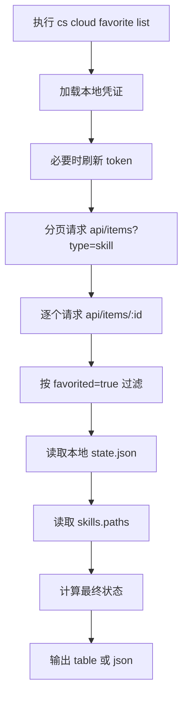
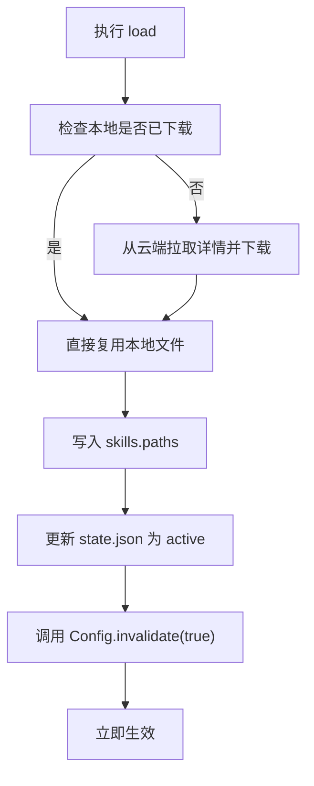

# cs cloud favorite 方案设计文档

本文档整理 `cs cloud favorite` 功能的设计目标、状态模型、实现方案、目录布局、命令行为、测试策略以及当前限制，方便后续维护、合入上游与继续演进。

## 1. 背景与目标

用户希望在 `cs cloud` 下扩展一组围绕 costrict-web 服务端收藏能力的 CLI 命令，满足以下需求：

1. 增加 `favorite list`，查看 costrict-web 的服务端收藏列表。
2. 支持对收藏项执行：查看 / 下载 / 加载 / 卸载 / 卸载本地文件。
3. 状态流转为：`Cloud -> Downloaded -> Active -> Unloaded`。
4. 下载、加载、卸载不需要重启程序。
5. 尽量最小改动；如需新增代码，优先放入 `costrict` 目录，便于管理与合入上游。

## 2. 设计原则

本方案遵循以下设计原则：

- **最小改动优先**：复用现有 CLI、配置系统、skill 加载链路和认证能力。
- **先支持 skill**：当前只支持 `skill` 类型收藏，避免同时引入多种扩展类型的安装/运行态管理。
- **下载与激活解耦**：`download` 只负责本地落盘，`load` 负责真正启用。
- **无重启生效**：通过修改全局配置并调用 `Config.invalidate(true)` 触发即时生效。
- **与上游兼容**：新增逻辑集中在 `packages/opencode/src/costrict/cloud/` 与少量 CLI 接入点。

## 3. 为什么当前只支持 skill

为了满足“最小改动”，当前实现只处理服务端收藏中的 `skill`：

- skill 已经具备成熟的本地落盘形式：`SKILL.md`
- skill 已有现成加载入口：`config.skills.paths`
- skill 可以通过配置刷新立即生效，无需专门扩展复杂运行时容器

如果一开始同时支持 `subagent / command / mcp / plugin`，会额外引入：

- 多种安装结构与元数据适配
- 多种激活路径与配置注入逻辑
- 更多回滚与状态一致性处理

因此本期范围锁定在 **favorite skill management**。

## 4. 功能范围

### 4.1 支持的命令

当前 `cs cloud favorite` 支持：

- `cs cloud favorite list`
- `cs cloud favorite view <slug-or-id>`
- `cs cloud favorite download <slug-or-id>`
- `cs cloud favorite load <slug-or-id>`
- `cs cloud favorite unload <slug-or-id>`
- `cs cloud favorite uninstall <slug-or-id>`
- `cs cloud favorite --help`
- `cs cloud favorite help`

### 4.2 输出格式

- `list` 支持 `--format table|json`
- `view` 支持 `--format table|json`

### 4.3 非目标

本期不做：

- 收藏项的新增/取消收藏操作
- 非 skill 类型收藏项的安装与激活
- 交互式选择 favorite 项
- 复杂权限模型或本地多用户隔离
- 独立的长期驻留运行态管理器

## 5. 状态模型设计

### 5.1 用户态状态

外部展示的状态为：

- `Cloud`
- `Downloaded`
- `Active`
- `Unloaded`

### 5.2 状态流转总览

当前状态流转如下：

```text
Cloud -> Downloaded -> Active -> Unloaded
```

除此之外还有两条重要回路：

```text
Cloud --load--> Active
Unloaded --load--> Active
Downloaded/Active/Unloaded --uninstall--> Cloud
```

### 5.3 状态流转规则说明

#### 规则 1：Cloud -> Downloaded

执行：

- `cs cloud favorite download <slug-or-id>`

效果：

- 从云端获取 skill 内容
- 本地落盘 `SKILL.md` 与 `item.json`
- 更新 `state.json`
- **不会写入 `skills.paths`**
- 因此状态只会进入 `Downloaded`

#### 规则 2：Cloud -> Active

执行：

- `cs cloud favorite load <slug-or-id>`

效果：

- 若本地尚未下载，会先自动下载
- 然后把路径写入 `skills.paths`
- 调用 `Config.invalidate(true)`
- 因此 `load` 结束后直接进入 `Active`

这意味着：

- `load` = “确保本地已下载 + 立即启用”
- 不再保留独立的 `Loaded` 中间状态

#### 规则 3：Downloaded -> Active

执行：

- `cs cloud favorite load <slug-or-id>`

效果：

- 复用已下载的本地文件
- 将路径加入 `skills.paths`
- 立即生效

#### 规则 4：Active -> Unloaded

执行：

- `cs cloud favorite unload <slug-or-id>`

效果：

- 从 `skills.paths` 中移除本地路径
- 调用 `Config.invalidate(true)`
- 保留本地文件
- 状态变为 `Unloaded`

#### 规则 5：Unloaded -> Active

执行：

- `cs cloud favorite load <slug-or-id>`

效果：

- 不重新下载文件
- 重新加入 `skills.paths`
- 立即恢复为 `Active`

#### 规则 6：Downloaded / Active / Unloaded -> Cloud

执行：

- `cs cloud favorite uninstall <slug-or-id>`

效果：

- 删除本地 skill 目录
- 删除本地 state 记录
- 若处于激活态则先移除 `skills.paths`
- 最终回到 `Cloud`

### 5.4 各状态含义定义

#### Cloud

- 收藏存在于服务端
- 本地未安装
- 本地状态文件中无记录

#### Downloaded

- skill 已经下载并落盘到本地
- 未加入 `skills.paths`
- 还没有在当前 CLI 配置里启用

#### Active

- skill 已在本地存在
- 对应路径已写入全局配置 `skills.paths`
- 已触发 `Config.invalidate(true)`
- 无需重启即可生效
- `load` 完成后直接进入该状态

#### Unloaded

- skill 仍保留在本地
- 已从 `skills.paths` 中移除
- 已触发配置刷新
- 当前未激活
- 可以通过再次 `load` 恢复为 `Active`

### 5.5 内部状态映射

内部持久化生命周期使用：

- `downloaded`
- `active`
- `unloaded`

外部状态计算逻辑：

1. 若本地无记录，则显示 `Cloud`
2. 若本地路径存在于 `Config.getGlobal().skills.paths`，则显示 `Active`
3. 否则根据本地 `lifecycle` 映射为：
   - `unloaded -> Unloaded`
   - 其他 -> `Downloaded`

> 说明：如果本地记录曾标记为 `active`，但当前配置中已经没有对应 path，则说明真实运行态已不激活。此时状态会保守回退显示为 `Downloaded`，不会继续显示 `Active`。

## 6. 总体架构

### 6.1 模块划分

本功能主要由两个模块组成：

| 模块         | 文件路径                                           | 职责                                      |
| ------------ | -------------------------------------------------- | ----------------------------------------- |
| CLI 命令入口 | `packages/opencode/src/cli/cmd/cloud.ts`           | 定义 `cs cloud favorite` 命令、帮助与输出 |
| 收藏核心逻辑 | `packages/opencode/src/costrict/cloud/favorite.ts` | 拉取收藏、状态管理、下载/加载/卸载        |

### 6.2 设计思路

整体思路是：

1. 从云端查询用户收藏的 skill 列表
2. 拉取详情，构造可操作的 favorite skill 数据
3. 将本地状态持久化到 `costrict/cloud-favorites/state.json`
4. 将已下载 skill 落盘到本地专属目录
5. `load` 时通过修改 `skills.paths` 注入 skill 目录
6. 调用 `Config.invalidate(true)` 实现无重启生效

## 7. 服务端数据获取方案

### 7.1 现状

仓库中可以明确看到 favorite 的写接口，但没有直接搜到“我的收藏列表”专用接口。

实际联调中发现：

- `/api/items/{id}/favorite` 可用于收藏与取消收藏
- `/api/items/{id}` 详情中含有 `favorited` 字段
- `/api/items?...` 可列出 skill 项，但列表结果本身未稳定返回用户 favorite 状态

### 7.2 当前实现方案

为了在缺少明确 favorites list API 的前提下尽快实现功能，当前采用如下策略：

1. 分页请求 `/api/items?type=skill&page=<n>&pageSize=<size>`
2. 获取候选 skill 列表
3. 对候选项逐个请求 `/api/items/{id}`
4. 通过详情里的 `favorited === true` 过滤出真正收藏项

核心函数：

- `listRemoteSkillCandidates()`
- `getRemoteSkill(id)`
- `listFavoriteSkills()`

### 7.3 优缺点

优点：

- 不依赖服务端新增接口
- 立即可用
- 能准确拿到详情与 `favorited` 状态

缺点：

- 需要多次请求，性能较差
- 分页扫描规模大时开销增加
- 依赖服务端详情接口稳定返回 `favorited`

### 7.4 后续优化方向

如果后续服务端明确提供“我的收藏列表”接口，可以将当前实现替换为：

- 单次或少量分页请求 favorite list
- 减少逐项详情请求
- 明确支持按用户收藏维度筛选 skill

## 8. 认证与请求模型

### 8.1 认证来源

复用现有 CoStrict 登录凭证：

- `loadCoStrictCredentials()`
- `saveCoStrictCredentials()`

### 8.2 token 刷新逻辑

在 `createAuthenticatedFetch()` 中：

1. 读取本地凭证
2. 若 access token 失效且存在 refresh token，则尝试刷新
3. 刷新成功后回写本地凭证
4. 失败则提示重新登录

复用能力：

- `isCoStrictTokenValid()`
- `refreshCoStrictToken()`
- `extractExpiryFromJWT()`
- `parseJWT()`

### 8.3 统一请求入口

`createAuthenticatedFetch()` 返回：

- `baseUrl`
- `userID`
- `json<T>(url)` 方法

这样 favorite 模块不需要重复处理认证头、token 刷新和错误格式。

## 9. 本地目录布局设计

### 9.1 根目录

本地 favorite 专属目录位于：

`Global.Path.config/costrict/cloud-favorites`

### 9.2 目录结构

```text
<config>/costrict/cloud-favorites/
├── skills/
│   └── <slug>/
│       ├── SKILL.md
│       └── item.json
└── state.json
```

### 9.3 文件职责

#### SKILL.md

- skill 的实际内容文件
- 供 skill 发现与加载链路直接使用

#### item.json

- 保存服务端返回的基础元数据快照
- 便于排查与后续扩展

#### state.json

- 保存 favorite 的本地生命周期状态
- 记录 slug、id、localPath、lifecycle、时间戳等信息

## 10. 配置接入设计

### 10.1 为什么复用 skills.paths

为了保证改动最小，当前不新增新的专用配置段，而是直接复用已有：

- `skills.paths`

原因：

- skill 加载链路已经依赖该字段
- 改动小，兼容已有技能发现能力
- 调用 `Config.invalidate(true)` 后即可生效

### 10.2 配置文件定位

全局配置文件按以下顺序查找：

1. `opencode.jsonc`
2. `opencode.json`
3. `config.json`

若都不存在，则默认写入 `opencode.jsonc`。

### 10.3 配置更新方式

通过 `jsonc-parser`：

- `modify()`
- `applyEdits()`

对 `skills.paths` 做增删，避免粗暴覆盖整个配置文件。

核心函数：

- `patchGlobalSkillPaths()`
- `addSkillPath()`
- `removeSkillPath()`

## 11. 无重启生效方案

### 11.1 核心机制

`download` 本身只落盘，不要求即时生效。

真正影响运行态的是：

- `loadFavoriteSkill()`
- `unloadFavoriteSkill()`
- `uninstallFavoriteSkill()`

这三个动作在修改配置后都会调用：

```ts
await Config.invalidate(true)
```

### 11.2 为什么不需要重启

`Config.invalidate(true)` 会使配置缓存失效，并等待相关依赖刷新，进而让后续 skill 发现逻辑读取到最新的 `skills.paths`。

因此：

- `load` 后立即可被新的 skill 发现流程感知
- `unload` 后立即从活动配置中移除

这满足“下载、加载、卸载不需要重启程序”的要求。

## 12. 命令行为说明

### 12.1 list

用途：

- 查看当前云端收藏的 skill 列表
- 同时显示每项在本地的状态

输出字段：

- `status`
- `slug`
- `name`
- `description`

### 12.2 view

用途：

- 查看单个收藏 skill 的详细信息

输出内容包括：

- name
- slug
- id
- type
- status
- favorites count
- version
- local path（如存在）
- description

### 12.3 download

行为：

1. 拉取收藏项详情
2. 本地落盘 `SKILL.md` 与 `item.json`
3. 在 `state.json` 中记录为 `downloaded`

不会自动激活，只进入 `Downloaded`。

### 12.4 load

行为：

1. 确保 skill 已下载
2. 若未下载则自动下载
3. 将本地路径加入 `skills.paths`
4. 本地状态改为 `active`
5. 调用 `Config.invalidate(true)`

结果：

- skill 立即生效
- `load` 后直接进入 `Active`

### 12.5 unload

行为：

1. 确保 skill 已下载
2. 从 `skills.paths` 中移除本地路径
3. 状态改为 `unloaded`
4. 调用 `Config.invalidate(true)`

结果：

- skill 保留在本地
- 但不再处于激活状态

### 12.6 uninstall

行为：

1. 确保 skill 已下载
2. 从 `skills.paths` 中移除路径
3. 删除本地目录
4. 从 `state.json` 中删除记录
5. 调用 `Config.invalidate(true)`

结果：

- 状态恢复为 `Cloud`

### 12.7 help

支持两种帮助入口：

- `cs cloud favorite --help`
- `cs cloud favorite help`

其中：

- `--help` 使用 yargs 默认帮助
- `help` 为显式帮助子命令，便于统一命令体验

## 13. 核心实现流程

### 13.1 list 流程



### 13.2 load 流程



## 14. 测试设计

### 14.1 测试文件

- `packages/opencode/test/costrict/cloud/favorite.test.ts`

### 14.2 覆盖点

当前自动化测试覆盖：

1. **只列出真正 favorited 的 skill**
2. **状态流转测试**：
   - `Cloud -> Downloaded -> Active -> Unloaded -> Cloud`
3. **配置写入测试**：
   - `load` 会写入 `skills.paths`
   - `unload` 会移除 `skills.paths`
4. **配置刷新调用测试**：
   - 确认 `Config.invalidate(true)` 在关键步骤被调用

### 14.3 测试方法

使用：

- `tmpdir()` 创建临时 home 与 config 目录
- mock `fetch` 模拟服务端 favorite list 与详情接口
- 真实验证本地文件、状态文件与配置文件变化

已验证命令：

```bash
bun test test/costrict/cloud/favorite.test.ts
bun run typecheck
```

## 15. 当前限制与已知问题

### 15.1 服务端接口不够理想

当前没有直接依赖专门的 favorites list API，而是通过：

- 列表扫描
- 详情过滤 `favorited`

这在数据规模大时效率不高。

### 15.2 仅支持 skill

当前不支持：

- subagent
- command
- mcp
- plugin 其他扩展形态

### 15.3 配置解析采用轻量处理

当前在更新 `skills.paths` 前，会做一层较轻量的 JSON/JSONC 文本处理。这满足当前需求，但若后续配置结构更复杂，可以进一步统一到更强的配置写入抽象中。

## 16. 后续演进建议

建议按以下顺序演进：

### 16.1 服务端提供 favorites list API

优先级最高。可以显著降低请求量与实现复杂度。

### 16.2 扩展更多收藏类型

在 skill 稳定后，按类型逐步支持：

- subagent
- command
- mcp

建议不要一次性全部放开，而是按安装链路成熟度逐步接入。

### 16.3 增加命令层测试

当前重点覆盖的是核心模块 `favorite.ts`。后续可补：

- `cs cloud favorite list`
- `cs cloud favorite help`
- 参数错误与异常路径

### 16.4 增加错误恢复与用户提示

例如：

- token 刷新失败
- 远端 item 已删除
- 本地目录损坏
- 配置文件内容异常

可以进一步提升 CLI 的可诊断性。

## 17. 涉及文件清单

### 17.1 生产代码

- `packages/opencode/src/cli/cmd/cloud.ts`
- `packages/opencode/src/costrict/cloud/favorite.ts`

### 17.2 测试代码

- `packages/opencode/test/costrict/cloud/favorite.test.ts`

### 17.3 文档

- `docs/cloud-favorite-design.md`

## 18. 结论

本方案以“**最小改动 + skill 优先 + download/load 分离 + 无重启生效**”为核心，完成了 `cs cloud favorite` 的第一版落地：

- 将服务端收藏 skill 引入 CLI 管理能力
- 提供清晰的生命周期状态模型
- 复用既有配置与 skill 加载链路
- 通过 `Config.invalidate(true)` 实现无需重启的即时生效
- 使用 `costrict` 目录承载本地新增逻辑，便于与上游代码解耦

当前版本中：

- `download` 表示“仅下载到本地，不启用”
- `load` 表示“确保已下载，并立即启用”
- `unload` 表示“停用但保留本地文件”
- `uninstall` 表示“彻底移除本地副本，回到 Cloud”

该方案已经具备可用性与可维护性，适合作为后续扩展收藏能力的基础版本。
