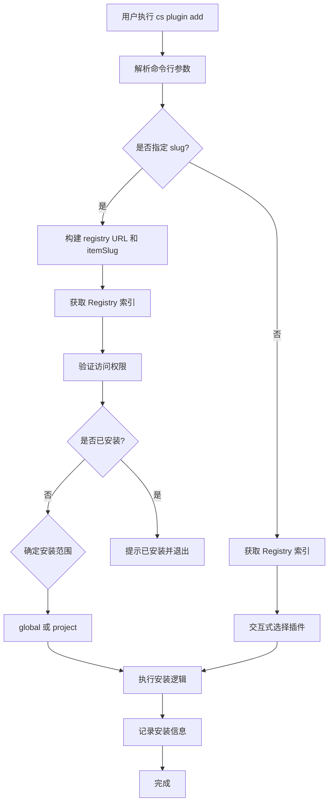

# cs plugin add 命令执行流程详解

本文档详细介绍 `cadd` 命令的执行流程和关键代码模块。

## 命令概述

`cs plugin add` 是 CoStrict 的插件安装命令，用于从 Registry 安装扩展（skills、agents、commands、mcp）。

## 执行流程图



## 核心模块

| 模块 | 文件路径 | 功能 |
|------|----------|------|
| 命令入口 | `packages/opencode/src/cli/cmd/plugin.ts` | 命令定义、参数解析、流程控制 |
| Registry 客户端 | `packages/opencode/src/costrict/registry/client.ts` | 索引获取、认证 token 解析 |
| 安装逻辑 | `packages/opencode/src/costrict/registry/install.ts` | 插件文件下载、安装配置写入 |
| 安装记录 | `packages/opencode/src/costrict/registry/record.ts` | installed-plugins.json 管理 |
| 类型定义 | `packages/opencode/src/costrict/registry/types.ts` | 数据结构定义 |

## 详细流程

### 1. 命令入口与参数解析

位置：[`packages/opencode/src/cli/cmd/plugin.ts`](packages/opencode/src/cli/cmd/plugin.ts:51)

```typescript
const PluginAddCommand = cmd({
  command: "add [slug]",
  describe: "install an extension from the registry",
  builder: (yargs) =>
    yargs
      .positional("slug", { type: "string", describe: "extension slug, optionally prefixed with org (org/slug)" })
      .option("global", { type: "boolean", alias: "g", describe: "install globally" }),
  async handler(args) {
    // 核心逻辑
  },
})
```

支持的参数格式：
- `cs plugin add` - 交互式选择插件
- `cs plugin add <slug>` - 指定插件（可选 org 前缀，如 `org/slug`）
- `cs plugin add <slug> --global` 或 `cs plugin add -g <slug>` - 全局安装

### 2. Registry URL 解析

位置：[`plugin.ts:20-26`](packages/opencode/src/cli/cmd/plugin.ts:20)

```typescript
function resolveRegistryUrl(slug: string | undefined): { registryUrl: string; itemSlug: string | undefined } {
  const base = registryBase()  // 默认: ${getCoStrictBaseURL()}/registry
  if (!slug) return { registryUrl: `${base}/${DEFAULT_ORG}`, itemSlug: undefined }
  const sep = slug.indexOf("/")
  if (sep === -1) return { registryUrl: `${base}/${DEFAULT_ORG}`, itemSlug: slug }
  return { registryUrl: `${base}/${slug.slice(0, sep)}`, itemSlug: slug.slice(sep + 1) }
}
```

URL 解析规则：
- 无参数 → 使用默认组织 `public`
- 仅有 slug → `public/slug`
- `org/slug` → `org/slug`

### 3. 获取 Registry 索引

位置：[`client.ts:86-103`](packages/opencode/src/costrict/registry/client.ts:86)

```typescript
export async function fetchIndex(registryUrl: string): Promise<IndexJson> {
  const base = registryUrl.endsWith("/") ? registryUrl : `${registryUrl}/`
  const url = new URL("index.json", base).href

  const token = await resolveToken(registryUrl)
  const headers: Record<string, string> = token ? { Authorization: `Bearer ${token}` } : {}

  const res = await fetch(url, { headers })
  // 处理 401/403 错误
  return res.json()
}
```

Registry 索引结构（[`types.ts:23-26`](packages/opencode/src/costrict/registry/types.ts:23)）：

```typescript
type IndexJson = {
  version: 1
  items: RegistryItem[]
}
```

### 4. 认证与权限验证

位置：[`client.ts:55-84`](packages/opencode/src/costrict/registry/client.ts:55)

```typescript
export async function resolveToken(url: string): Promise<string | undefined> {
  const parsed = parseRegistryOrg(url)
  if (!parsed) return undefined

  // 1. 检查访问缓存
  const cached = await readAccessCache(parsed.origin, parsed.org)
  const isPublic = cached ?? await fetchAccess(parsed.origin, parsed.org)

  // 2. 公开仓库无需 token
  if (isPublic) return undefined

  // 3. 私有仓库需要登录
  const credentials = await loadCoStrictCredentials()
  if (!credentials) throw new NotLoggedInError()

  // 4. 验证并刷新 token
  if (isCoStrictTokenValid(credentials)) return credentials.access_token
  const refreshed = await refreshCoStrictToken({...})
  return refreshed.access_token
}
```

访问检测流程：
1. 探测 `/registry/{org}/access` 端点
2. 缓存结果 1 小时（[`ACCESS_CACHE_TTL = 60 * 60 * 1000`](packages/opencode/src/costrict/registry/client.ts:12)）
3. 公开仓库直接访问，私有仓库需要认证

### 5. 插件选择

位置：[`plugin.ts:87-107`](packages/opencode/src/cli/cmd/plugin.ts:87)

```typescript
if (itemSlug) {
  // 直接指定 slug
  const found = index.items.find((i) => i.slug === itemSlug)
  if (!found) {
    prompts.log.error(`Extension not found: ${itemSlug}`)
    return
  }
  item = found
} else {
  // 交互式选择
  const installed = await Record.all()
  const installedSlugs = new Set(installed.map((i) => i.slug))
  const options = index.items.map((i) => ({
    label: i.name,
    value: i.slug,
    hint: `${i.type}${installedSlugs.has(i.slug) ? " · installed" : ""} — ${i.description}`,
  }))
  const selected = await prompts.select({ message: "Select extension", options })
  item = index.items.find((i) => i.slug === selected)!
}
```

### 6. 安装范围确定

位置：[`plugin.ts:36-49, 116`](packages/opencode/src/cli/cmd/plugin.ts:36)

```typescript
async function resolveScope(interactive: boolean): Promise<InstallScope> {
  if (!interactive) return "global"
  const project = Instance.project
  if (project.vcs !== "git") return "global"
  
  // 交互式选择：全局安装 / 当前项目安装
  const result = await prompts.select<InstallScope>({
    message: "Install location",
    options: [
      { label: "Global", value: "global", hint: "available in all projects" },
      { label: "Current project", value: "project", hint: Instance.worktree },
    ],
  })
  return result
}
```

安装范围规则：
- 非交互模式 → 全局
- 非 Git 项目 → 全局
- Git 项目 → 交互式选择

### 7. 插件安装

位置：[`install.ts:159-170`](packages/opencode/src/costrict/registry/install.ts:159)

根据插件类型执行不同安装逻辑：

```typescript
export async function install(item: RegistryItem, registryUrl: string, scope: InstallScope): Promise<void> {
  switch (item.type) {
    case "skill":
      return installSkill(item, registryUrl, scope)
    case "subagent":
    case "command":
      await installFileItem(item, registryUrl, scope)
      return
    case "mcp":
      return installMcp(item, registryUrl, scope)
  }
}
```

#### 7.1 Skill 安装

位置：[`install.ts:65-75`](packages/opencode/src/costrict/registry/install.ts:65)

```typescript
export async function installSkill(item: RegistryItemFile, registryUrl: string, scope: InstallScope): Promise<void> {
  const token = await resolveToken(registryUrl)
  const dest = path.join(Discovery.dir(), item.slug)  // skills 目录
  
  // 并行下载所有文件
  await Promise.all(item.files.map((f) => downloadFile(registryUrl, item.slug, f, dest, token)))
  
  // 添加 registry URL 到配置
  await addSkillUrl(registryUrl, scope)
}
```

安装位置：
- 全局：`$CONFIG_DIR/skills/{slug}/`
- 项目：`{worktree}/.costrict/skills/{slug}/`

#### 7.2 Subagent/Command 安装

位置：[`install.ts:93-114`](packages/opencode/src/costrict/registry/install.ts:93)

```typescript
export async function installFileItem(item: RegistryItemFile, registryUrl: string, scope: InstallScope): Promise<string> {
  const dir = scope === "global"
    ? path.join(Global.Path.config, item.type === "subagent" ? "agent" : "commands")
    : path.join(Instance.worktree, ".costrict", item.type === "subagent" ? "agent" : "commands")

  for (const file of item.files) {
    await downloadFile(registryUrl, item.slug, file, dir, token)
  }
}
```

安装位置：
- subagent：
  - 全局：`$CONFIG_DIR/agent/`
  - 项目：`{worktree}/.costrict/agent/`
- command：
  - 全局：`$CONFIG_DIR/commands/`
  - 项目：`{worktree}/.costrict/commands/`

#### 7.3 MCP 安装

位置：[`install.ts:136-146`](packages/opencode/src/costrict/registry/install.ts:136)

```typescript
export async function installMcp(item: RegistryItem, registryUrl: string, scope: InstallScope): Promise<void> {
  const configPath = scope === "global" ? globalConfigPath() : projectConfigPath()
  
  // 使用 jsonc-parser 修改配置
  const edits = modify(text, ["mcp", item.slug], item.mcp as Config.Mcp, {...})
  await Filesystem.write(configPath, applyEdits(text, edits))
}
```

MCP 配置位置：
- 全局：`$CONFIG_DIR/costrict.json`
- 项目：`{worktree}/.costrict/costrict.json`

### 8. 安装记录

位置：[`record.ts:24-29`](packages/opencode/src/costrict/registry/record.ts:24)

安装完成后，将插件信息写入 `installed-plugins.json`：

```typescript
export async function add(entry: InstalledEntry): Promise<void> {
  const record = await read()
  record.items = record.items.filter((i) => i.slug !== entry.slug)  // 去重
  record.items.push(entry)
  await write(record)
}

export function make(item, registry, scope): InstalledEntry {
  return {
    slug: item.slug,
    type: item.type,
    name: item.name,
    registry,
    scope,
    installedAt: new Date().toISOString(),
  }
}
```

记录文件位置：`$CONFIG_DIR/installed-plugins.json`

## 插件类型

| 类型 | 描述 | 配置方式 |
|------|------|----------|
| `skill` | 可执行的脚本/任务技能 | 下载到 skills 目录 + 配置文件 |
| `subagent` | 子代理定义 | 下载到 agent 目录 |
| `command` | 自定义命令 | 下载到 commands 目录 |
| `mcp` | MCP 服务器配置 | 写入 costrict.json 的 mcp 字段 |

## 错误处理

位置：[`plugin.ts:28-34`](packages/opencode/src/cli/cmd/plugin.ts:28)

| 错误类型 | 条件 | 提示信息 |
|----------|------|----------|
| `NotLoggedInError` | 需要认证但未登录 | "Run: cs auth login" |
| `UnauthorizedError` | Token 无效 | "Run: cs auth login to re-authenticate" |
| `ForbiddenError` | 无权限访问 | "Contact your organization admin" |
| `AlreadyInstalledError` | 插件已安装 | "Run: cs plugin update" |

## 相关配置

- 全局配置：`$CONFIG_DIR/costrict.json`
- 项目配置：`{worktree}/.costrict/costrict.json`
- 安装记录：`$CONFIG_DIR/installed-plugins.json`
- Skills 目录：可通过 `Discovery.dir()` 获取
