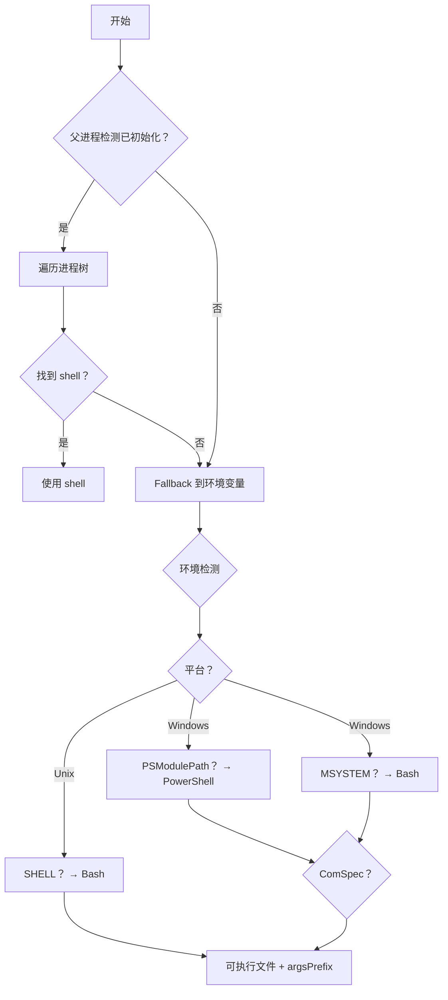

# 增强的 Shell 工具实现

这个增强的 shell 工具提供了先进的 shell 检测、优先级选择和动态提示注入策略。

## 概述

增强的 shell 工具（`src/plugin/tdd/tools/bash.ts` 中的 `BashTool`）提供：

- **Shell 优先级选择**：根据执行环境检测合适的 shell（bash、PowerShell、cmd）
- **父进程检测**：遍历进程树以找到实际的终端 shell
- **动态提示注入**：生成 shell 特定的引导和描述
- **后台进程支持**：处理如开发服务器等长时间运行的进程
- **跨平台兼容性**：在 Windows、macOS 和 Linux 上工作

## 架构

```
src/plugin/tdd/tools/
├── shell/
│   ├── index.ts         # 公共 API 导出
│   ├── shell-utils.ts   # Shell 检测、解析、工具函数
│   ├── shell-execution.ts   # 命令执行服务
│   ├── shell-tool.ts    # ShellToolInvocation 类
│   ├── systemEncoding.ts    # 系统编码检测和处理
│   ├── formatters.ts    # 格式化工具
│   └── utils-fallback.ts # Fallback 实现
└── bash.ts             # 增强的 BashTool，封装 shell 系统
```

## 核心功能

### 1. Shell 配置

**优先级顺序：**

1. 父进程检测（最准确）
2. 环境变量（fallback）
3. 平台默认值

**Shell 类型：**

- `bash`：类 Unix 系统、Git Bash、WSL
- `powershell`：PowerShell 7+ (pwsh) 和 PowerShell 5.x (powershell.exe)
- `cmd`：Windows 命令提示符

```typescript
const config = getShellConfiguration()
// { shell: 'bash', executable: 'bash', argsPrefix: ['-c'], version: '5.2.37' }
```

### 1.5 编码检测

**智能缓冲区编码选择策略：**

```typescript
import { getCachedEncodingForBuffer, getSystemEncoding, initializeEncodingCache } from "@/plugin/tdd/tools/shell"

// 在应用启动时初始化（在 bootstrap.ts 中调用）
initializeEncodingCache()

// 自动检测缓冲区编码
const buffer = childOutputBuffer
const encoding = getCachedEncodingForBuffer(buffer)
// 1. 首先检查是否为有效的 UTF-8（非常可靠）
// 2. 如果不是 UTF-8，使用系统编码（shell 特定）
// 3. 最终回退到 UTF-8
```

**系统编码检测逻辑：**

- **Windows bash**: 检查 `LANG` 环境变量（通常为 UTF-8）
- **Windows cmd/PowerShell**: 执行 `chcp` 获取代码页映射
  - CP 936 → GB2312（中文系统）
  - CP 950 → Big5（繁体中文）
  - CP 65001 → UTF-8
- **Unix-like**: 检查 `LC_ALL`/`LC_CTYPE`/`LANG` 环境变量

**关键特性：**

- **UTF-8 优先**: 首先验证缓冲区是否为有效 UTF-8
- **Shell 感知**: 系统编码基于实际执行的 shell，而非运行环境
- **混合环境支持**: 即使 PowerShell 使用 GBK，Go 程序的 UTF-8 输出仍能正确解码
- **缓存优化**: 系统编码被缓存以避免重复检测

### 2. 命令解析

使用 tree-sitter（bash）或 PowerShell AST 解析来：

- 提取命令根（用于权限/验证）
- 检测命令链（`&&` 和 `||`）
- 识别重定向操作符（`>`、`>>`、`<`）
- 检测后台语法

```typescript
getCommandRoots("npm install && npm run build")
// ['npm', 'npm']
```

### 3. 后台进程支持

**后台执行语法：**

- bash：`command &`
- PowerShell：`Start-Job -ScriptBlock { command }`
- cmd：`START /B command`

```typescript
const params: ShellToolParams = {
  command: "npm run dev",
  is_background: true,
}
```

### 4. Shell 特定提示

基于检测到的 shell 进行动态描述注入：

```typescript
// 对于 bash：
"Shell 环境：bash（类 Unix shell）
路径分隔符：始终使用正斜杠（/）作为文件路径
命令链：支持 && 和 || 操作符"

// 对于 PowerShell：
"Shell 环境：PowerShell（pwsh 或 powershell.exe）
路径分隔符：可以使用正斜杠（/）或反斜杠（\\）
命令链：支持 && 和 || 操作符（pwsh/PowerShell 7+）"
```

## 使用方法

### 基本命令执行

```typescript
import { BashTool } from "@/plugin/tdd/tools/bash"

const tool = BashTool
// 通过 Tool.execute 或集成使用
```

### Shell 配置

```typescript
import {
  getShellConfiguration,
  clearShellConfigurationCache,
  initializeParentProcessDetection,
} from "@/plugin/tdd/tools/shell"

// 初始化父进程检测（异步）
await initializeParentProcessDetection()

// 获取当前配置
const config = getShellConfiguration()

// 强制重新检测
clearShellConfigurationCache()
```

### 命令解析

```typescript
import { getCommandRoots, stripShellWrapper, hasBackgroundSyntax, addBackgroundSyntax } from "@/plugin/tdd/tools/shell"

const cmd = 'bash -c "npm run dev"'
const stripped = stripShellWrapper(cmd) // "npm run dev"
const roots = getCommandRoots(cmd) // ['npm']
```

## 测试

运行全面的测试套件：

```bash
bun test test/plugin/tdd/shell.test.ts
```

**测试覆盖：**

- Shell 配置检测
- 命令解析和根提取
- Shell 包装器剥离
- 后台语法检测
- Shell 描述生成
- 命令执行和中止处理
- 跨平台 shell 处理
- 编码检测和转换

**53 个测试（shell: 42 + encoding: 11），100% 通过**

## 从原始 BashTool 迁移

原始 BashTool（`@/tool/bash.ts`）保留用于参考。

**主要差异：**

1. Shell 检测而不是固定的 bash
2. Shell 特定的提示引导
3. 后台进程参数（`is_background`）
4. 增强的错误处理
5. 更好的跨平台支持

**参数兼容性：**

- `command`：✅ 相同
- `workdir`：✅ 相同（映射到 `dir_path`）
- `description`：✅ 相同
- `timeout`：✅ 相同
- `is_background`：⭐ 新增（增强功能）

## 实现细节

### Shell 检测算法



### 后台进程处理

该工具使用 shell 特定的后台语法：

| Shell      | 后台语法    | 示例                                     |
| ---------- | ----------- | ---------------------------------------- |
| bash       | `&`         | `npm run dev &`                          |
| PowerShell | `Start-Job` | `Start-Job -ScriptBlock { npm run dev }` |
| cmd        | `START /B`  | `START /B npm run dev`                   |

## 限制

1. **WASM 依赖**：完整的 tree-sitter 解析需要 wasm 二进制文件。提供了 fallback 实现。
2. **父进程检测**：可能在沙盒环境中失败；回退到环境检测。
3. **后台 PID**：仅在支持 `pgrep` 的非 Windows 平台上可用。

## 未来增强

- [ ] 交互式 shell 支持（PTY）
- [ ] 命令历史跟踪
- [ ] 命令完成建议
- [ ] 更复杂的后台进程管理
